# Dokumentasi Visual Flowchart & Sequence Diagram — Mobile Dumping System

> **📌 Akses Cepat File Visual:**
> - 🌐 **Interactive Diagram Viewer (Zoom, Pan, Download SVG/PNG):** [Buka visual_diagrams_viewer.html](file:///home/hotds-eric/Documents/Projects/dumping_system/docs/visual_diagrams_viewer.html)
> - 📁 **Direktori Gambar (PNG & SVG):** [docs/images/](file:///home/hotds-eric/Documents/Projects/dumping_system/docs/images/)

---

## 1. 🌐 High-Level End-to-End System Flowchart

Diagram alir tingkat tinggi yang menggambarkan keseluruhan alur sistem dari awal membuka aplikasi (Login & Cek Token), pemilihan modul, melewati gerbang validasi ganda Operator & Pengawas, eksekusi transaksi, hingga pencatatan ke SAP OData.

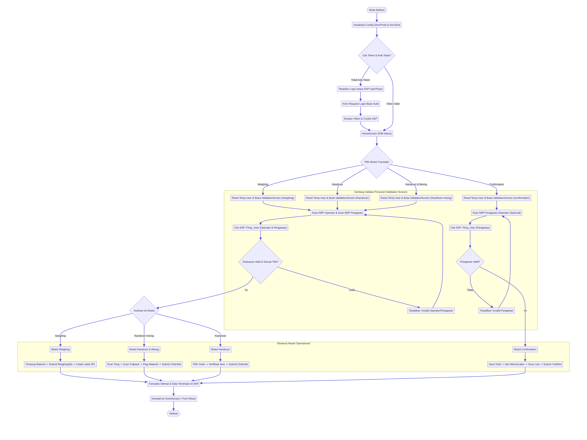

*Format Vektor:* [Buka File SVG (Crisp Infinite Zoom)](file:///home/hotds-eric/Documents/Projects/dumping_system/docs/images/01_end_to_end_flowchart.svg)

<b>Lihat Kode Mermaid Diagram 1</b>

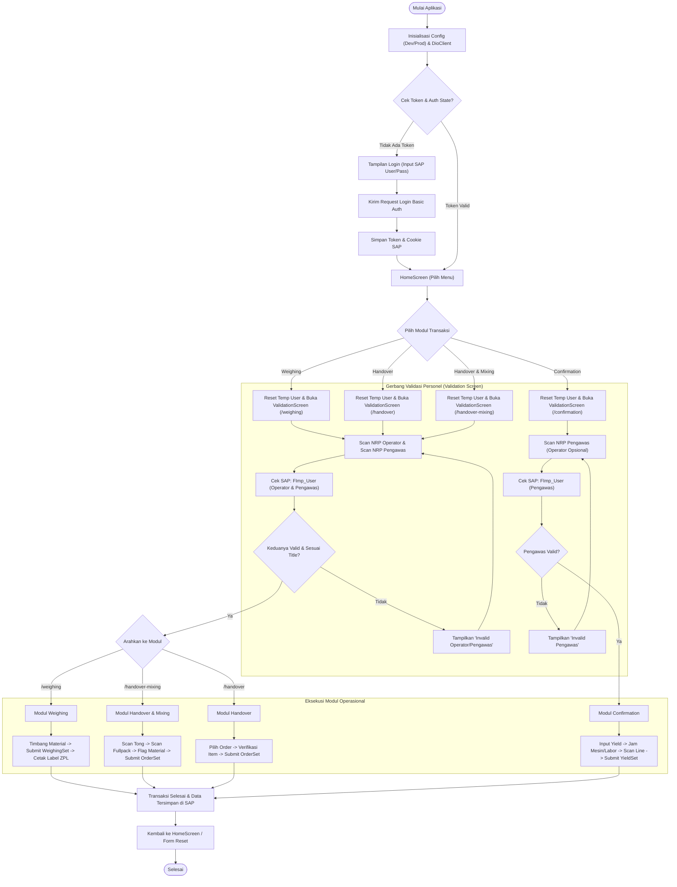
```mermaid
flowchart TD
    Start(["Mulai Aplikasi"]) --> InitConfig["Inisialisasi Config (Dev/Prod) & DioClient"]
    InitConfig --> CheckAuth{"Cek Token & Auth State?"}
    
    CheckAuth -- "Tidak Ada Token" --> ScreenLogin["Tampilan Login (Input SAP User/Pass)"]
    ScreenLogin --> DoLogin["Kirim Request Login Basic Auth"]
    DoLogin --> SaveToken["Simpan Token & Cookie SAP"]
    SaveToken --> ScreenHome
    
    CheckAuth -- "Token Valid" --> ScreenHome["HomeScreen (Pilih Menu)"]
    
    ScreenHome --> Choice{"Pilih Modul Transaksi"}
    
    Choice -- "Weighing" --> ResetAuthW["Reset Temp User & Buka ValidationScreen (/weighing)"]
    Choice -- "Handover" --> ResetAuthH["Reset Temp User & Buka ValidationScreen (/handover)"]
    Choice -- "Handover & Mixing" --> ResetAuthHM["Reset Temp User & Buka ValidationScreen (/handover-mixing)"]
    Choice -- "Confirmation" --> ResetAuthC["Reset Temp User & Buka ValidationScreen (/confirmation)"]
    
    subgraph Gatekeeper ["Gerbang Validasi Personel (Validation Screen)"]
        ResetAuthW & ResetAuthH & ResetAuthHM --> ScanDual["Scan NRP Operator & Scan NRP Pengawas"]
        ResetAuthC --> ScanSingle["Scan NRP Pengawas (Operator Opsional)"]
        
        ScanDual --> ValAPI1["Cek SAP: FImp_User (Operator & Pengawas)"]
        ScanSingle --> ValAPI2["Cek SAP: FImp_User (Pengawas)"]
        
        ValAPI1 --> CheckDual{"Keduanya Valid & Sesuai Title?"}
        ValAPI2 --> CheckSingle{"Pengawas Valid?"}
        
        CheckDual -- "Tidak" --> ErrorDual["Tampilkan 'Invalid Operator/Pengawas'"] --> ScanDual
        CheckSingle -- "Tidak" --> ErrorSingle["Tampilkan 'Invalid Pengawas'"] --> ScanSingle
    end

    CheckDual -- "Ya" --> RouteToModule{"Arahkan ke Modul"}
    CheckSingle -- "Ya" --> ModulConf["Modul Confirmation"]
    
    RouteToModule -- "/weighing" --> ModulWeigh["Modul Weighing"]
    RouteToModule -- "/handover" --> ModulHand["Modul Handover"]
    RouteToModule -- "/handover-mixing" --> ModulHandMix["Modul Handover & Mixing"]
    
    subgraph Execution ["Eksekusi Modul Operasional"]
        ModulWeigh --> FlowWeigh["Timbang Material -> Submit WeighingSet -> Cetak Label ZPL"]
        ModulHandMix --> FlowHM["Scan Tong -> Scan Fullpack -> Flag Material -> Submit OrderSet"]
        ModulHand --> FlowH["Pilih Order -> Verifikasi Item -> Submit OrderSet"]
        ModulConf --> FlowC["Input Yield -> Jam Mesin/Labor -> Scan Line -> Submit YieldSet"]
    end
    
    FlowWeigh & FlowHM & FlowH & FlowC --> FinishTx["Transaksi Selesai & Data Tersimpan di SAP"]
    FinishTx --> ReturnHome["Kembali ke HomeScreen / Form Reset"]
    ReturnHome --> End(["Selesai"])
```

---

## 2. 🔐 Detail Modul 1: Autentikasi & Validasi Personel (NRP Scan)

Sistem menerapkan validasi ganda (*Dual-Custody*) agar setiap tindakan operasional dipertanggungjawabkan oleh Operator dan Pengawas yang terdaftar di SAP.

### 2.1 Flowchart Validasi Personel

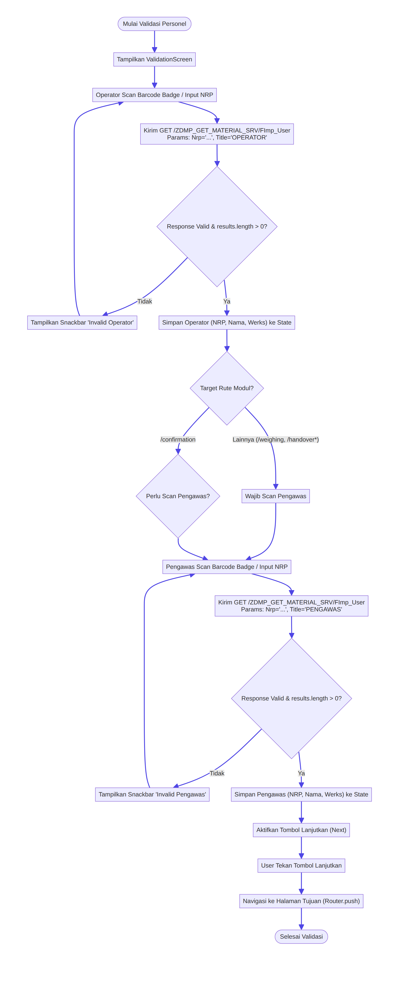

*Format Vektor:* [Buka File SVG](file:///home/hotds-eric/Documents/Projects/dumping_system/docs/images/02_user_validation_flowchart.svg)

<b>Lihat Kode Mermaid Diagram 2</b>

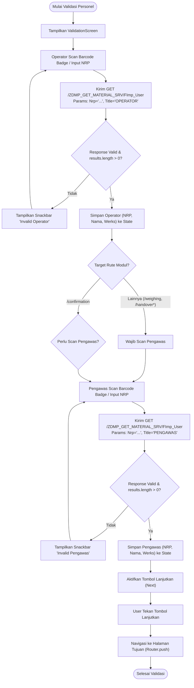
```mermaid
flowchart TD
    StartVal(["Mulai Validasi Personel"]) --> InitScreen["Tampilkan ValidationScreen"]
    InitScreen --> ScanOp["Operator Scan Barcode Badge / Input NRP"]
    
    ScanOp --> ReqOp["Kirim GET /ZDMP_GET_MATERIAL_SRV/FImp_User<br/>Params: Nrp='...', Title='OPERATOR'"]
    ReqOp --> RespOp{"Response Valid & results.length > 0?"}
    
    RespOp -- "Tidak" --> ErrOp["Tampilkan Snackbar 'Invalid Operator'"] --> ScanOp
    RespOp -- "Ya" --> SaveOp["Simpan Operator (NRP, Nama, Werks) ke State"]
    
    SaveOp --> CheckTarget{"Target Rute Modul?"}
    
    CheckTarget -- "/confirmation" --> CheckPengawasNeeded{"Perlu Scan Pengawas?"}
    CheckTarget -- "Lainnya (/weighing, /handover*)" --> ForcePengawas["Wajib Scan Pengawas"]
    
    ForcePengawas --> ScanSpv["Pengawas Scan Barcode Badge / Input NRP"]
    CheckPengawasNeeded --> ScanSpv
    
    ScanSpv --> ReqSpv["Kirim GET /ZDMP_GET_MATERIAL_SRV/FImp_User<br/>Params: Nrp='...', Title='PENGAWAS'"]
    ReqSpv --> RespSpv{"Response Valid & results.length > 0?"}
    
    RespSpv -- "Tidak" --> ErrSpv["Tampilkan Snackbar 'Invalid Pengawas'"] --> ScanSpv
    RespSpv -- "Ya" --> SaveSpv["Simpan Pengawas (NRP, Nama, Werks) ke State"]
    
    SaveSpv --> EnableBtn["Aktifkan Tombol Lanjutkan (Next)"]
    EnableBtn --> ClickNext["User Tekan Tombol Lanjutkan"]
    ClickNext --> RouteTarget["Navigasi ke Halaman Tujuan (Router.push)"]
    RouteTarget --> EndVal(["Selesai Validasi"])
```

### 2.2 Sequence Diagram Validasi Personel

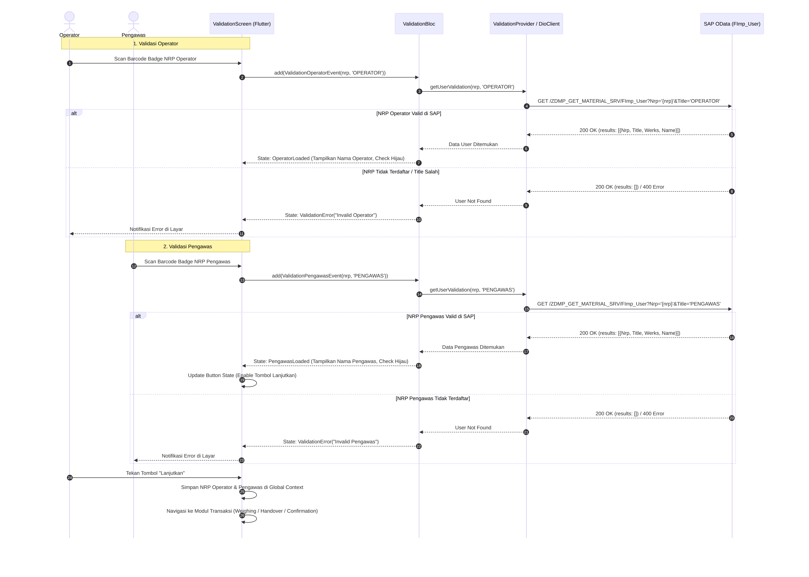

*Format Vektor:* [Buka File SVG](file:///home/hotds-eric/Documents/Projects/dumping_system/docs/images/03_user_validation_sequence.svg)

<b>Lihat Kode Mermaid Diagram 3</b>

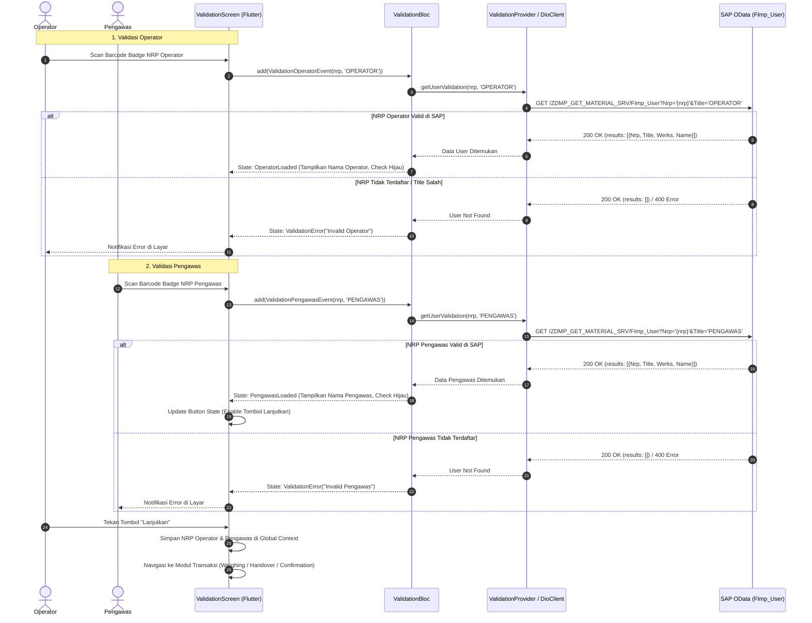
```mermaid
sequenceDiagram
    autonumber
    actor OP as Operator
    actor SPV as Pengawas
    participant UI as ValidationScreen (Flutter)
    participant Bloc as ValidationBloc
    participant Repo as ValidationProvider / DioClient
    participant SAP as SAP OData (FImp_User)

    Note over OP,UI: 1. Validasi Operator
    OP->>UI: Scan Barcode Badge NRP Operator
    UI->>Bloc: add(ValidationOperatorEvent(nrp, 'OPERATOR'))
    Bloc->>Repo: getUserValidation(nrp, 'OPERATOR')
    Repo->>SAP: GET /ZDMP_GET_MATERIAL_SRV/FImp_User?Nrp='{nrp}'&Title='OPERATOR'
    alt NRP Operator Valid di SAP
        SAP-->>Repo: 200 OK (results: [{Nrp, Title, Werks, Name}])
        Repo-->>Bloc: Data User Ditemukan
        Bloc-->>UI: State: OperatorLoaded (Tampilkan Nama Operator, Check Hijau)
    else NRP Tidak Terdaftar / Title Salah
        SAP-->>Repo: 200 OK (results: []) / 400 Error
        Repo-->>Bloc: User Not Found
        Bloc-->>UI: State: ValidationError("Invalid Operator")
        UI-->>OP: Notifikasi Error di Layar
    end

    Note over SPV,UI: 2. Validasi Pengawas
    SPV->>UI: Scan Barcode Badge NRP Pengawas
    UI->>Bloc: add(ValidationPengawasEvent(nrp, 'PENGAWAS'))
    Bloc->>Repo: getUserValidation(nrp, 'PENGAWAS')
    Repo->>SAP: GET /ZDMP_GET_MATERIAL_SRV/FImp_User?Nrp='{nrp}'&Title='PENGAWAS'
    alt NRP Pengawas Valid di SAP
        SAP-->>Repo: 200 OK (results: [{Nrp, Title, Werks, Name}])
        Repo-->>Bloc: Data Pengawas Ditemukan
        Bloc-->>UI: State: PengawasLoaded (Tampilkan Nama Pengawas, Check Hijau)
        UI->>UI: Update Button State (Enable Tombol Lanjutkan)
    else NRP Pengawas Tidak Terdaftar
        SAP-->>Repo: 200 OK (results: []) / 400 Error
        Repo-->>Bloc: User Not Found
        Bloc-->>UI: State: ValidationError("Invalid Pengawas")
        UI-->>SPV: Notifikasi Error di Layar
    end

    OP->>UI: Tekan Tombol "Lanjutkan"
    UI->>UI: Simpan NRP Operator & Pengawas di Global Context
    UI->>UI: Navigasi ke Modul Transaksi (Weighing / Handover / Confirmation)
```

---

## 3. ⚖️ Detail Modul 2: Weighing (Penimbangan & Cetak Label)

Mengelola pembacaan bobot secara live melalui koneksi socket TCP ke timbangan digital, verifikasi toleransi berat bersih (Netto = Bruto - Tara), pencatatan transaksi ke SAP `WeighingSet`, dan pencetakan label barcode wadah (ZPL) ke printer Zebra port 9100.

### 3.1 Flowchart Modul Weighing

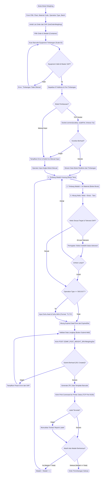

*Format Vektor:* [Buka File SVG](file:///home/hotds-eric/Documents/Projects/dumping_system/docs/images/04_weighing_flowchart.svg)

<b>Lihat Kode Mermaid Diagram 4</b>

```mermaid
flowchart TD
    StartW(["Mulai Modul Weighing"]) --> FormPilih["Form Pilih: Plant, Material Code, Operation Type, Batch"]
    FormPilih --> FetchOrders["Ambil List Order dari SAP (GetOrderWeighing)"]
    FetchOrders --> SelectOrder["Pilih Order & Wadah (Container)"]
    SelectOrder --> ScanScale["Scan Barcode Equipment Timbangan (Scale ID)"]
    
    ScanScale --> CheckEquip{"Equipment Valid di Master SAP?"}
    CheckEquip -- "Tidak" --> ErrEquip["Error: 'Timbangan Tidak Dikenal'"] --> ScanScale
    CheckEquip -- "Ya" --> GetScaleNet["Dapatkan IP Address & Port Timbangan"]
    
    GetScaleNet --> ModeCheck{"Mode Pembacaan?"}
    
    ModeCheck -- "TCP Socket" --> ConnectTCP["Socket.connect(scaleIp, scalePort, timeout: 5s)"]
    ConnectTCP --> ListenTCP{"Koneksi Berhasil?"}
    ListenTCP -- "Gagal" --> ManualPrompt["Tampilkan Error & Switch ke Manual Input"]
    ListenTCP -- "Sukses" --> StreamWeight["Stream Data Bobot Realtime dari Timbangan"]
    
    ModeCheck -- "Manual Input" --> ManualPrompt
    ManualPrompt --> InputMan["Operator Input Angka Bobot Manual"]
    
    StreamWeight & InputMan --> StepTara["1. Timbang Wadah Kosong (Bobot Tara)"]
    StepTara --> StepBruto["2. Timbang Wadah + Isi Material (Bobot Bruto)"]
    StepBruto --> CalcNetto["3. Hitung Netto: Netto = Bruto - Tara"]
    
    CalcNetto --> ValidateTolerance{"Netto Sesuai Target & Toleransi SAP?"}
    ValidateTolerance -- "Di Luar Toleransi" --> WarnTol["Peringatan: Bobot melebihi batas toleransi!"]
    WarnTol --> OperatorOverride{"Izinkan Lanjut?"}
    OperatorOverride -- "Ulangi" --> StepTara
    
    OperatorOverride -- "Lanjut" --> CheckOpType{"Operation Type == 'DECOCT'?"}
    ValidateTolerance -- "Sesuai" --> CheckOpType
    
    CheckOpType -- "Ya" --> InputTemp["Input Suhu Awal & Suhu Akhir (Format: 'T1;T2')"]
    CheckOpType -- "Tidak" --> CalcExp["Hitung Expired Date/Time dari ExpiredSet"]
    InputTemp --> CalcExp
    
    CalcExp --> ReadySubmit["Validasi Data Lengkap (Button Submit Aktif)"]
    ReadySubmit --> SubmitSAP["Kirim POST /ZDMP_POST_WEIGHT_SRV/WeighingSet"]
    
    SubmitSAP --> CheckSubmit{"Submit Berhasil (201 Created)?"}
    CheckSubmit -- "Gagal" --> ShowErr["Tampilkan Pesan Error dari SAP"] --> ReadySubmit
    CheckSubmit -- "Sukses" --> GenZPL["Generate ZPL Data Template Barcode"]
    
    GenZPL --> PrintPrompt["Kirim Print Command ke Printer Zebra (TCP Port 9100)"]
    PrintPrompt --> PrintResult{"Label Tercetak?"}
    PrintResult -- "Gagal" --> RetryPrint["Munculkan Tombol 'Reprint Label'"]
    PrintResult -- "Sukses" --> NextContainer{"Masih Ada Wadah Berikutnya?"}
    RetryPrint --> NextContainer
    
    NextContainer -- "Ya (Wadah < Total)" --> IncWadah["Wadah = Wadah + 1"] --> StepTara
    NextContainer -- "Selesai (Wadah == Total)" --> FinishW(["Order Penimbangan Selesai"])
```

### 3.2 Sequence Diagram Modul Weighing

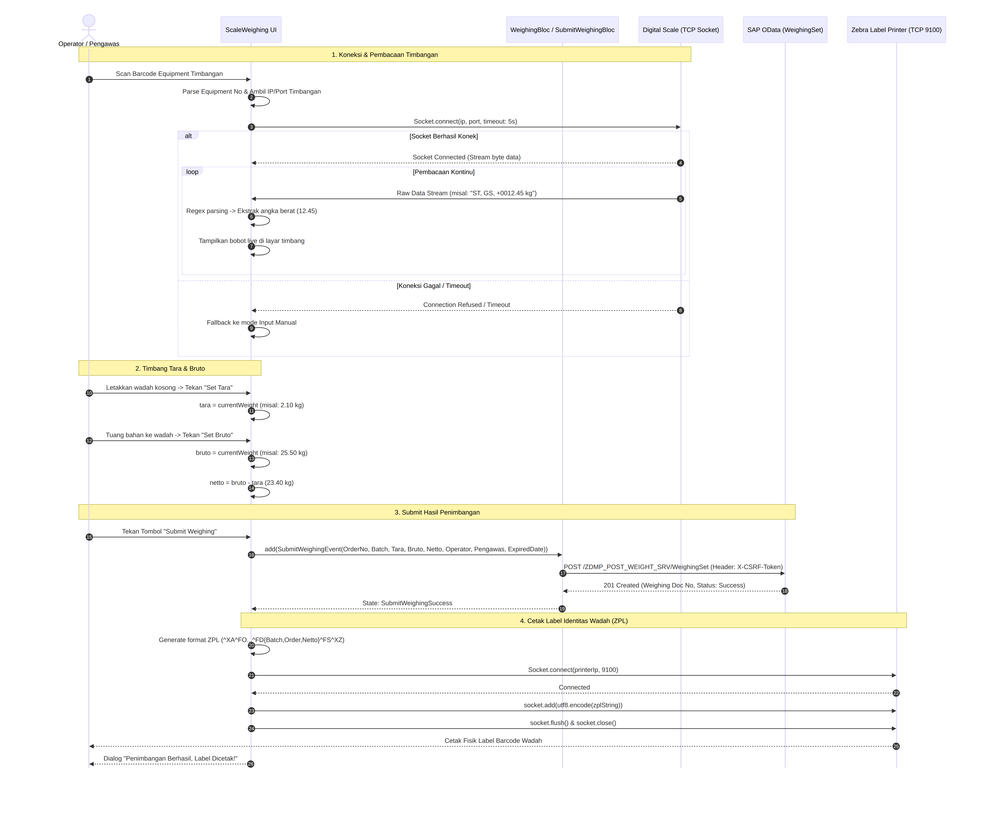

*Format Vektor:* [Buka File SVG](file:///home/hotds-eric/Documents/Projects/dumping_system/docs/images/05_weighing_sequence.svg)

<b>Lihat Kode Mermaid Diagram 5</b>

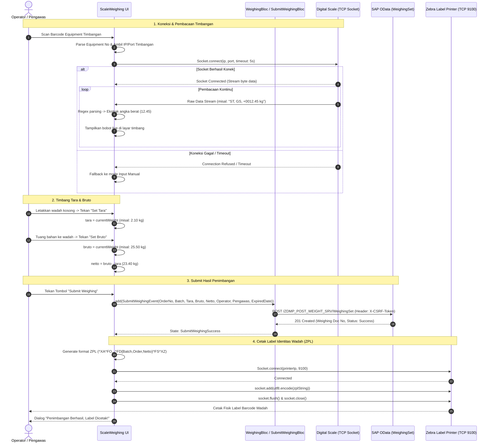
```mermaid
sequenceDiagram
    autonumber
    actor OP as Operator / Pengawas
    participant UI as ScaleWeighing UI
    participant Bloc as WeighingBloc / SubmitWeighingBloc
    participant Scale as Digital Scale (TCP Socket)
    participant SAP as SAP OData (WeighingSet)
    participant Printer as Zebra Label Printer (TCP 9100)

    Note over OP,Scale: 1. Koneksi & Pembacaan Timbangan
    OP->>UI: Scan Barcode Equipment Timbangan
    UI->>UI: Parse Equipment No & Ambil IP/Port Timbangan
    UI->>Scale: Socket.connect(ip, port, timeout: 5s)
    alt Socket Berhasil Konek
        Scale-->>UI: Socket Connected (Stream byte data)
        loop Pembacaan Kontinu
            Scale->>UI: Raw Data Stream (misal: "ST, GS, +0012.45 kg")
            UI->>UI: Regex parsing -> Ekstrak angka berat (12.45)
            UI->>UI: Tampilkan bobot live di layar timbang
        end
    else Koneksi Gagal / Timeout
        Scale-->>UI: Connection Refused / Timeout
        UI->>UI: Fallback ke mode Input Manual
    end

    Note over OP,UI: 2. Timbang Tara & Bruto
    OP->>UI: Letakkan wadah kosong -> Tekan "Set Tara"
    UI->>UI: tara = currentWeight (misal: 2.10 kg)
    OP->>UI: Tuang bahan ke wadah -> Tekan "Set Bruto"
    UI->>UI: bruto = currentWeight (misal: 25.50 kg)
    UI->>UI: netto = bruto - tara (23.40 kg)

    Note over OP,SAP: 3. Submit Hasil Penimbangan
    OP->>UI: Tekan Tombol "Submit Weighing"
    UI->>Bloc: add(SubmitWeighingEvent(OrderNo, Batch, Tara, Bruto, Netto, Operator, Pengawas, ExpiredDate))
    Bloc->>SAP: POST /ZDMP_POST_WEIGHT_SRV/WeighingSet (Header: X-CSRF-Token)
    SAP-->>Bloc: 201 Created (Weighing Doc No, Status: Success)
    Bloc-->>UI: State: SubmitWeighingSuccess

    Note over UI,Printer: 4. Cetak Label Identitas Wadah (ZPL)
    UI->>UI: Generate format ZPL (^XA^FO...^FD{Batch,Order,Netto}^FS^XZ)
    UI->>Printer: Socket.connect(printerIp, 9100)
    Printer-->>UI: Connected
    UI->>Printer: socket.add(utf8.encode(zplString))
    UI->>Printer: socket.flush() & socket.close()
    Printer-->>OP: Cetak Fisik Label Barcode Wadah
    UI-->>OP: Dialog "Penimbangan Berhasil, Label Dicetak!"
```

---

## 4. 🔀 Detail Modul 3: Handover & Mixing (Serah Terima & Scan Tong)

Memverifikasi barcode wadah (Tong) dan barcode komponen bahan (Fullpack/MaterialSet) dengan aturan urutan prioritas BOM (*sequence check*). Tiap material yang lolos verifikasi langsung di-flag ke SAP via `MaterialFlagSet`, lalu seluruh order di-complete via `OrderSet`.

### 4.1 Flowchart Handover & Mixing

*Format Vektor:* [Buka File SVG](file:///home/hotds-eric/Documents/Projects/dumping_system/docs/images/06_handover_mixing_flowchart.svg)

<b>Lihat Kode Mermaid Diagram 6</b>

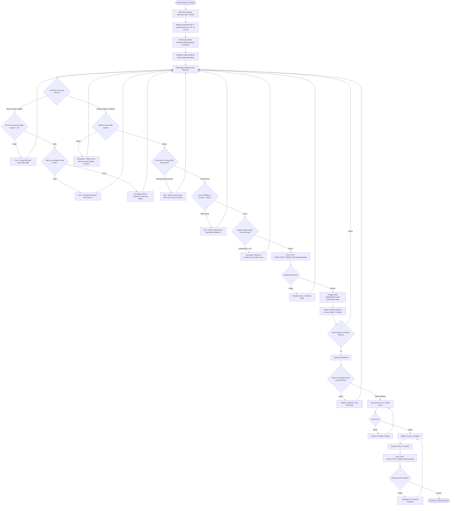
```mermaid
flowchart TD
    StartHM(["Mulai Handover & Mixing"]) --> SelectOrderHM["Pilih Plant, Material, Operation Type, & Batch"]
    SelectOrderHM --> MapOpApps["Mapping OperationType -> OperationApps (31, 32, 33, 34, 45)"]
    MapOpApps --> FetchWadah["Ambil Data Wadah: GetWadahSet(RoutingNo, ActivityNo)"]
    
    FetchWadah --> DisplayTongs["Tampilkan Daftar Wadah & Daftar Material/Fullpack"]
    DisplayTongs --> WaitScan["Menunggu Operator Scan Barcode"]
    
    WaitScan --> DetectType{"Jenis Barcode yang Discan?"}
    
    DetectType -- "Barcode Tong / Wadah" --> CheckTongFormat{"Format Tong Sesuai (Split length >= 4)?"}
    CheckTongFormat -- "Salah" --> ErrTong["Error: 'Format Barcode Tong Tidak Valid'"] --> WaitScan
    CheckTongFormat -- "Valid" --> MatchTong{"Tong Cocok dengan Daftar Order?"}
    MatchTong -- "Tidak" --> ErrMatchT["Error: 'Tong Bukan Bagian dari Order Ini'"] --> WaitScan
    MatchTong -- "Cocok" --> SetTongActive["Set Wadah Aktif & Tampilkan Komponen Bahan"] --> WaitScan
    
    DetectType -- "Barcode Bahan / Fullpack" --> CheckTongSelected{"Apakah Tong Sudah Dipilih?"}
    CheckTongSelected -- "Belum" --> WarnTongFirst["Peringatan: 'Silakan Scan Barcode Tong Terlebih Dahulu!'"] --> WaitScan
    CheckTongSelected -- "Sudah" --> CheckPriority{"Cek Urutan Prioritas BOM (Sequence)?"}
    
    CheckPriority -- "Melompat (Skip Priority)" --> ErrPrio["Error: 'Bahan Harus Discan Berurutan Sesuai Prioritas!'"] --> WaitScan
    CheckPriority -- "Urutan Benar" --> MatchBOM{"Cocok: BOMItem + Counter + Batch?"}
    
    MatchBOM -- "Tidak Cocok" --> ErrBOM["Error: 'Bahan Tidak Sesuai Spesifikasi Wadah Ini'"] --> WaitScan
    MatchBOM -- "Cocok" --> CheckFlagged{"Apakah Bahan Sudah Pernah Di-flag?"}
    CheckFlagged -- "Sudah (flag == 'X')" --> WarnFlagged["Peringatan: 'Bahan Ini Sudah Discan Sebelumnya'"] --> WaitScan
    
    CheckFlagged -- "Belum" --> SendFlagSAP["Kirim POST /ZDMP_POST_ORDER_SRV/MaterialFlagSet"]
    SendFlagSAP --> FlagResult{"Flag Berhasil (201)?"}
    FlagResult -- "Gagal" --> ErrFlag["Tampilkan Error & Rollback State"] --> WaitScan
    FlagResult -- "Sukses" --> ReloadWadah["Panggil Ulang GetWadahSet untuk Sinkronisasi State"]
    
    ReloadWadah --> UpdateUI["Update Checklist Material di Layar (Hijau / Centang)"]
    UpdateUI --> CheckAllItems{"Semua Bahan di Tong Ini Selesai?"}
    
    CheckAllItems -- "Belum" --> WaitScan
    CheckAllItems -- "Ya" --> MarkTongComplete["Tandai Tong Selesai"]
    
    MarkTongComplete --> CheckAllTongs{"Semua Tong dalam Order Sudah Selesai?"}
    CheckAllTongs -- "Belum" --> NextTongPrompt["Pindah ke Wadah / Tong Berikutnya"] --> WaitScan
    
    CheckAllTongs -- "Semua Selesai" --> ScanLineHM["Scan Barcode Line / Mesin Tujuan"]
    ScanLineHM --> CheckLineHM{"Line Terisi?"}
    CheckLineHM -- "Belum" --> DisableSubmit["Tombol Complete Disabled"] --> ScanLineHM
    CheckLineHM -- "Sudah" --> EnableSubmitHM["Aktifkan Tombol 'Complete'"]
    
    EnableSubmitHM --> ClickSubmitHM["Operator Tekan 'Complete'"]
    ClickSubmitHM --> PostOrderSet["Kirim POST /ZDMP_POST_ORDER_SRV/OrderSet"]
    
    PostOrderSet --> ResOrderSet{"Response SAP Selesai?"}
    ResOrderSet -- "Gagal" --> ErrOrderSet["Tampilkan Error Submit Handover"] --> EnableSubmitHM
    ResOrderSet -- "Sukses" --> FinishHM(["Handover & Mixing Selesai"])
```

### 4.2 Sequence Diagram Handover & Mixing

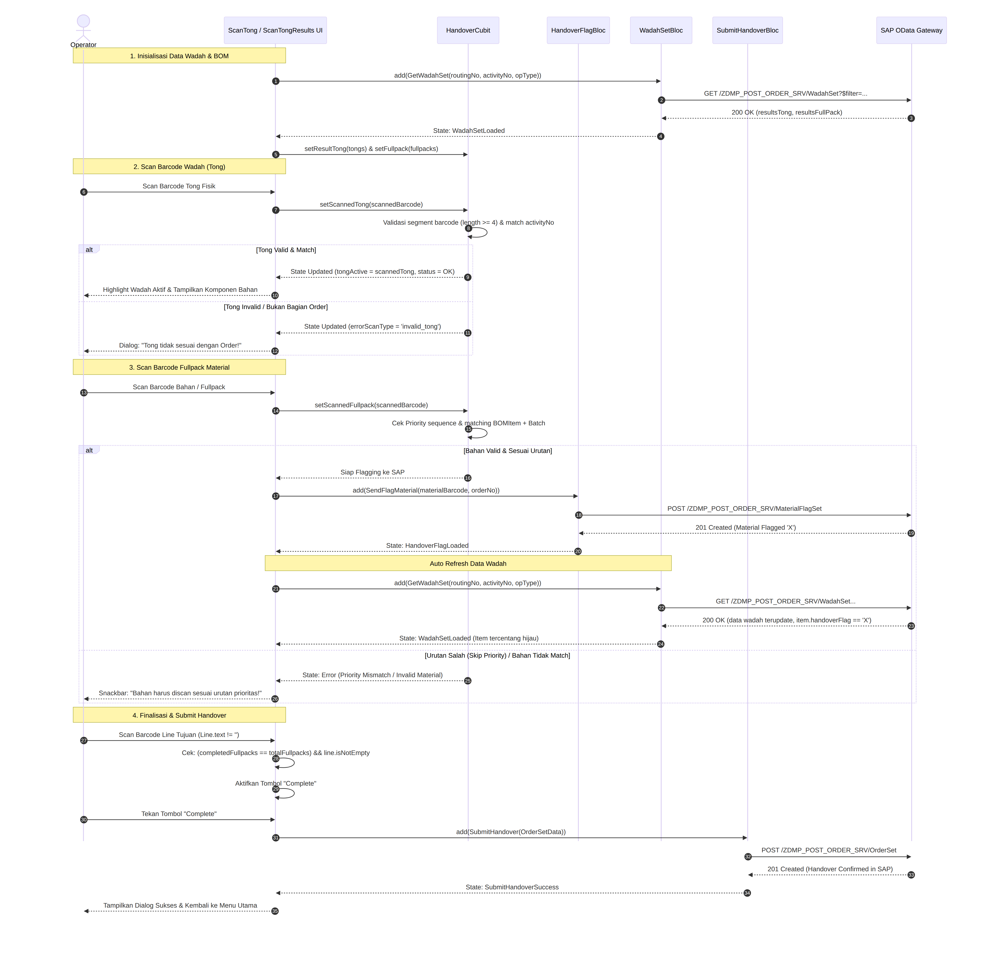

*Format Vektor:* [Buka File SVG](file:///home/hotds-eric/Documents/Projects/dumping_system/docs/images/07_handover_mixing_sequence.svg)

<b>Lihat Kode Mermaid Diagram 7</b>

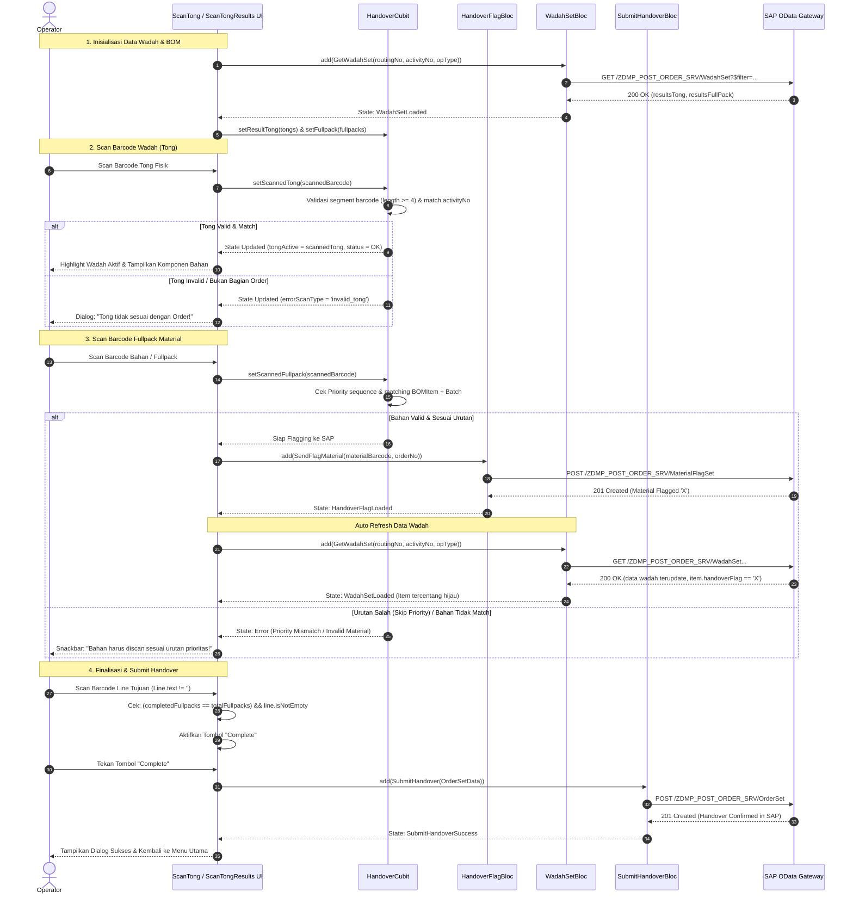
```mermaid
sequenceDiagram
    autonumber
    actor OP as Operator
    participant UI as ScanTong / ScanTongResults UI
    participant Cubit as HandoverCubit
    participant FlagBloc as HandoverFlagBloc
    participant WadahBloc as WadahSetBloc
    participant SubmitBloc as SubmitHandoverBloc
    participant SAP as SAP OData Gateway

    Note over OP,UI: 1. Inisialisasi Data Wadah & BOM
    UI->>WadahBloc: add(GetWadahSet(routingNo, activityNo, opType))
    WadahBloc->>SAP: GET /ZDMP_POST_ORDER_SRV/WadahSet?$filter=...
    SAP-->>WadahBloc: 200 OK (resultsTong, resultsFullPack)
    WadahBloc-->>UI: State: WadahSetLoaded
    UI->>Cubit: setResultTong(tongs) & setFullpack(fullpacks)

    Note over OP,UI: 2. Scan Barcode Wadah (Tong)
    OP->>UI: Scan Barcode Tong Fisik
    UI->>Cubit: setScannedTong(scannedBarcode)
    Cubit->>Cubit: Validasi segment barcode (length >= 4) & match activityNo
    alt Tong Valid & Match
        Cubit-->>UI: State Updated (tongActive = scannedTong, status = OK)
        UI-->>OP: Highlight Wadah Aktif & Tampilkan Komponen Bahan
    else Tong Invalid / Bukan Bagian Order
        Cubit-->>UI: State Updated (errorScanType = 'invalid_tong')
        UI-->>OP: Dialog: "Tong tidak sesuai dengan Order!"
    end

    Note over OP,UI: 3. Scan Barcode Fullpack Material
    OP->>UI: Scan Barcode Bahan / Fullpack
    UI->>Cubit: setScannedFullpack(scannedBarcode)
    Cubit->>Cubit: Cek Priority sequence & matching BOMItem + Batch
    alt Bahan Valid & Sesuai Urutan
        Cubit-->>UI: Siap Flagging ke SAP
        UI->>FlagBloc: add(SendFlagMaterial(materialBarcode, orderNo))
        FlagBloc->>SAP: POST /ZDMP_POST_ORDER_SRV/MaterialFlagSet
        SAP-->>FlagBloc: 201 Created (Material Flagged 'X')
        FlagBloc-->>UI: State: HandoverFlagLoaded
        
        Note over UI,WadahBloc: Auto Refresh Data Wadah
        UI->>WadahBloc: add(GetWadahSet(routingNo, activityNo, opType))
        WadahBloc->>SAP: GET /ZDMP_POST_ORDER_SRV/WadahSet...
        SAP-->>WadahBloc: 200 OK (data wadah terupdate, item.handoverFlag == 'X')
        WadahBloc-->>UI: State: WadahSetLoaded (Item tercentang hijau)
    else Urutan Salah (Skip Priority) / Bahan Tidak Match
        Cubit-->>UI: State: Error (Priority Mismatch / Invalid Material)
        UI-->>OP: Snackbar: "Bahan harus discan sesuai urutan prioritas!"
    end

    Note over OP,UI: 4. Finalisasi & Submit Handover
    OP->>UI: Scan Barcode Line Tujuan (Line.text != '')
    UI->>UI: Cek: (completedFullpacks == totalFullpacks) && line.isNotEmpty
    UI->>UI: Aktifkan Tombol "Complete"
    OP->>UI: Tekan Tombol "Complete"
    UI->>SubmitBloc: add(SubmitHandover(OrderSetData))
    SubmitBloc->>SAP: POST /ZDMP_POST_ORDER_SRV/OrderSet
    SAP-->>SubmitBloc: 201 Created (Handover Confirmed in SAP)
    SubmitBloc-->>UI: State: SubmitHandoverSuccess
    UI-->>OP: Tampilkan Dialog Sukses & Kembali ke Menu Utama
```

---

## 5. ✅ Detail Modul 4: Confirmation (Konfirmasi Hasil Produksi / Yield)

Mencatat konfirmasi kuantitas hasil produksi aktual (`YieldQty`), jam kerja mesin (`MachineHour`), dan kalkulasi otomatis jam tenaga kerja (`LaborHour = MachineHour * NumberOfLabor`) ke modul SAP Production Order (PP/CO).

### 5.1 Flowchart Modul Confirmation

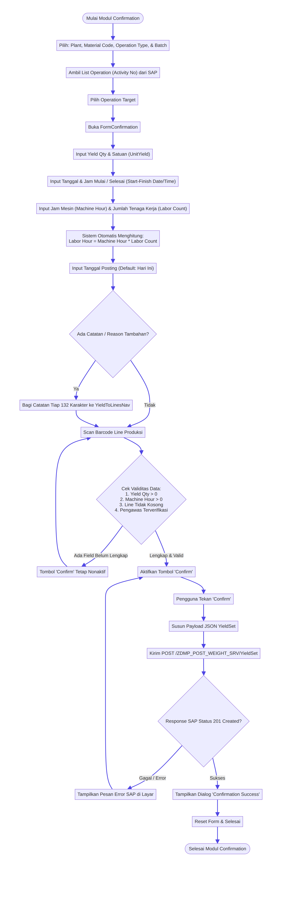

*Format Vektor:* [Buka File SVG](file:///home/hotds-eric/Documents/Projects/dumping_system/docs/images/08_confirmation_flowchart.svg)

<b>Lihat Kode Mermaid Diagram 8</b>

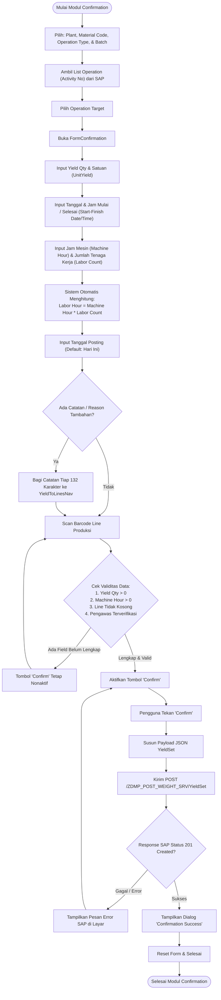
```mermaid
flowchart TD
    StartC(["Mulai Modul Confirmation"]) --> SelectOrderC["Pilih: Plant, Material Code, Operation Type, & Batch"]
    SelectOrderC --> FetchOps["Ambil List Operation (Activity No) dari SAP"]
    FetchOps --> SelectOp["Pilih Operation Target"]
    
    SelectOp --> OpenFormConf["Buka FormConfirmation"]
    
    OpenFormConf --> InputYield["Input Yield Qty & Satuan (UnitYield)"]
    InputYield --> InputTime["Input Tanggal & Jam Mulai / Selesai (Start-Finish Date/Time)"]
    InputTime --> InputMachine["Input Jam Mesin (Machine Hour) & Jumlah Tenaga Kerja (Labor Count)"]
    
    InputMachine --> CalcLabor["Sistem Otomatis Menghitung:<br/>Labor Hour = Machine Hour * Labor Count"]
    
    CalcLabor --> InputPostDate["Input Tanggal Posting (Default: Hari Ini)"]
    InputPostDate --> InputReason{"Ada Catatan / Reason Tambahan?"}
    
    InputReason -- "Ya" --> SplitReason["Bagi Catatan Tiap 132 Karakter ke YieldToLinesNav"]
    InputReason -- "Tidak" --> ScanLineC
    SplitReason --> ScanLineC["Scan Barcode Line Produksi"]
    
    ScanLineC --> ValidateAllFields{"Cek Validitas Data:<br/>1. Yield Qty > 0<br/>2. Machine Hour > 0<br/>3. Line Tidak Kosong<br/>4. Pengawas Terverifikasi"}
    
    ValidateAllFields -- "Ada Field Belum Lengkap" --> DisableConfirm["Tombol 'Confirm' Tetap Nonaktif"] --> ScanLineC
    ValidateAllFields -- "Lengkap & Valid" --> EnableConfirm["Aktifkan Tombol 'Confirm'"]
    
    EnableConfirm --> ClickConfirm["Pengguna Tekan 'Confirm'"]
    ClickConfirm --> BuildBody["Susun Payload JSON YieldSet"]
    BuildBody --> PostYield["Kirim POST /ZDMP_POST_WEIGHT_SRV/YieldSet"]
    
    PostYield --> CheckYieldResp{"Response SAP Status 201 Created?"}
    CheckYieldResp -- "Gagal / Error" --> ShowYieldErr["Tampilkan Pesan Error SAP di Layar"] --> EnableConfirm
    CheckYieldResp -- "Sukses" --> SuccessDialog["Tampilkan Dialog 'Confirmation Success'"]
    SuccessDialog --> ResetForm["Reset Form & Selesai"]
    ResetForm --> EndC(["Selesai Modul Confirmation"])
```

### 5.2 Sequence Diagram Modul Confirmation

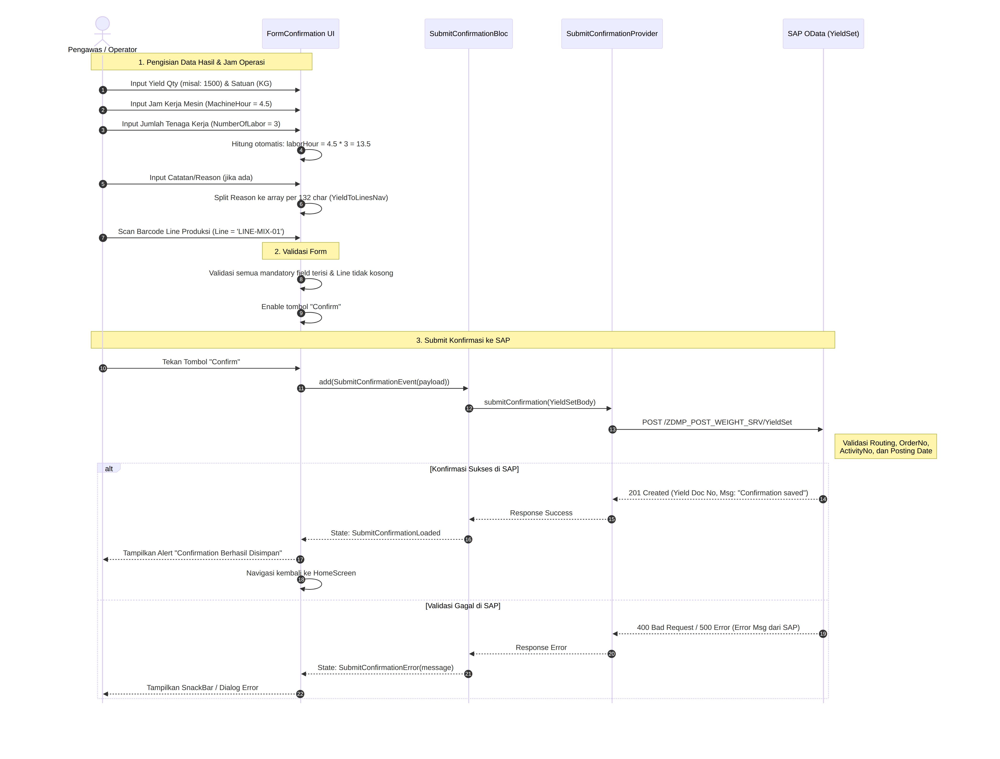

*Format Vektor:* [Buka File SVG](file:///home/hotds-eric/Documents/Projects/dumping_system/docs/images/09_confirmation_sequence.svg)

<b>Lihat Kode Mermaid Diagram 9</b>

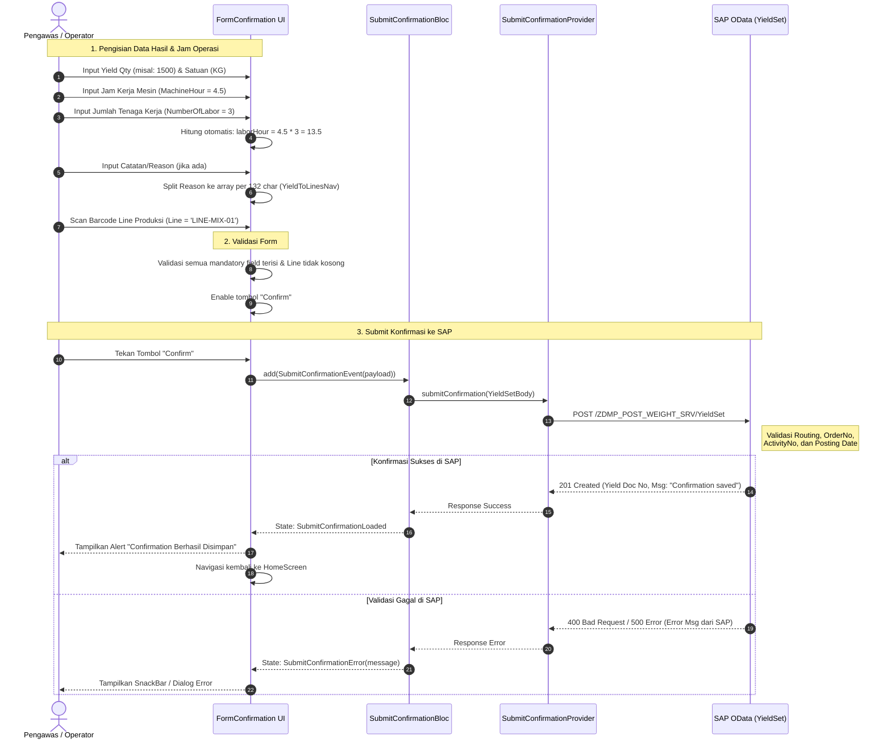
```mermaid
sequenceDiagram
    autonumber
    actor SPV as Pengawas / Operator
    participant UI as FormConfirmation UI
    participant Bloc as SubmitConfirmationBloc
    participant Repo as SubmitConfirmationProvider
    participant SAP as SAP OData (YieldSet)

    Note over SPV,UI: 1. Pengisian Data Hasil & Jam Operasi
    SPV->>UI: Input Yield Qty (misal: 1500) & Satuan (KG)
    SPV->>UI: Input Jam Kerja Mesin (MachineHour = 4.5)
    SPV->>UI: Input Jumlah Tenaga Kerja (NumberOfLabor = 3)
    UI->>UI: Hitung otomatis: laborHour = 4.5 * 3 = 13.5
    SPV->>UI: Input Catatan/Reason (jika ada)
    UI->>UI: Split Reason ke array per 132 char (YieldToLinesNav)
    SPV->>UI: Scan Barcode Line Produksi (Line = 'LINE-MIX-01')

    Note over UI: 2. Validasi Form
    UI->>UI: Validasi semua mandatory field terisi & Line tidak kosong
    UI->>UI: Enable tombol "Confirm"

    Note over SPV,SAP: 3. Submit Konfirmasi ke SAP
    SPV->>UI: Tekan Tombol "Confirm"
    UI->>Bloc: add(SubmitConfirmationEvent(payload))
    Bloc->>Repo: submitConfirmation(YieldSetBody)
    Repo->>SAP: POST /ZDMP_POST_WEIGHT_SRV/YieldSet
    Note right of SAP: Validasi Routing, OrderNo,<br/>ActivityNo, dan Posting Date
    alt Konfirmasi Sukses di SAP
        SAP-->>Repo: 201 Created (Yield Doc No, Msg: "Confirmation saved")
        Repo-->>Bloc: Response Success
        Bloc-->>UI: State: SubmitConfirmationLoaded
        UI-->>SPV: Tampilkan Alert "Confirmation Berhasil Disimpan"
        UI->>UI: Navigasi kembali ke HomeScreen
    else Validasi Gagal di SAP
        SAP-->>Repo: 400 Bad Request / 500 Error (Error Msg dari SAP)
        Repo-->>Bloc: Response Error
        Bloc-->>UI: State: SubmitConfirmationError(message)
        UI-->>SPV: Tampilkan SnackBar / Dialog Error
    end
```

---

## 6. 📊 Tabel Ringkasan Endpoint & Transaksi

| Modul | Endpoint OData SAP | Method | Aktor Utama | Integrasi Hardware | Output Transaksi |
|---|---|---|---|---|---|
| **User Validation** | `/ZDMP_GET_MATERIAL_SRV/FImp_User` | `GET` | Operator & Pengawas | Barcode Scanner (Badge) | Validated NRP Context |
| **Weighing** | `/ZDMP_POST_WEIGHT_SRV/WeighingSet` | `POST` | Operator + Pengawas | TCP Scale Socket & Zebra Printer (Port 9100) | Dokumen Timbang & Label Barcode Fisik |
| **Handover (Flag)** | `/ZDMP_POST_ORDER_SRV/MaterialFlagSet` | `POST` | Operator | Barcode Scanner (Tong & Fullpack) | Status Scan per item (`handoverFlag = 'X'`) |
| **Handover (Submit)** | `/ZDMP_POST_ORDER_SRV/OrderSet` | `POST` | Operator + Pengawas | Barcode Scanner (Line) | Dokumen Serah Terima Resmi SAP |
| **Confirmation** | `/ZDMP_POST_WEIGHT_SRV/YieldSet` | `POST` | Pengawas | Barcode Scanner (Line) | Dokumen Yield Confirmation SAP (PP/CO) |
